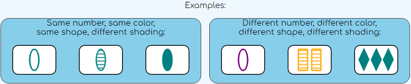
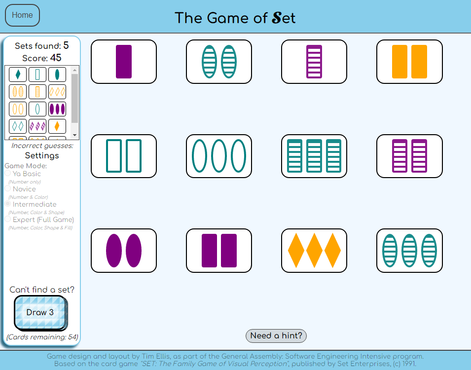

# The_Game_of_Set
*A casual gameplay recreation the card game "SET" published by Set Enterprises ((c) 1991) using front-end web development languages -- javascript, html and css.* 

*Created by Tim E. as part of the General Assembly SEI Program, Mar. 2022*

### Description

SET is a card game based on logic and visual reasoning, in which players race to find as many SETs as they can. The game is quite fun, and definitely exercises the brain: because it has a rule of logic, and because players must apply this rule to the spatial array of patterns all at once, they must use both left brain and right brain thought processes. It's great as a solo game, or in a group. 

In normal group play, there are no "turns": instead, the first player to see a SET calls out “SET!” and grabs the cards. At the end of the game, the player with the most SETs wins. In my experience the game can get tense and competitive, but I enjoy the complexity of the overlapping conditions the game employs. So, I set out to make a non-competitive, solitaire-style version of the game in which the player can scale the difficulty to thier desired level and enjoy playing the game at their own pace. 

## Game Play
### The Rules
In the game of Set, each card has a unique combination of 4 different features: number of symbols, color, shape, and shading: 

A Set is created by finding three cards where each individual feature (color, shape, number and shading) is either **all** the same OR **all** different. All of the features must separately satisfy this rule. *(In other words: shape must be either the same on all 3 cards, or different on each of the 3 cards; color must be either the same on all 3 cards, or different on each of the 3, etc.)*

### Game Play
12 cards are played to the table. The player clicks on three cards they believe comprise a Set. If they meet the requirements, they are removed from the board and 3 new cards are placed. Otherwise, they remain on the table and play continues. If there is not a Set on the board, 3 more cards can be dealt to the table. Those 3 cards are not replaced when the next Set is found, reducing the number back to 12.

### Game Modes

The traditional game of SET is generally played with all four criteria required for each Set, which can be difficult. In this game, you can select a difficulty level to make your game play the most enjoyable:

- "Novice" requires only numbers and colors to make a Set.
- "Intermediate" requires numbers, colors and shapes to make a Set.
- "Expert" is the full traditional game play.
- "Ya Basic" requires only numbers, and is largely included for very young players or for testing purposes.

Once a Game Mode is selected and the cards are dealt, the Game Mode is locked and cannot be changed.

### Scoring

Each Set is worth 3 points, times a multiplier that is based on your selected Game Mode difficulty level, (1x for basic, 2x for novice, 3x for intermediate, and 4x for expert). If the player requires a first hint, score is reduced by 1 x multiplier; a second hint costs 2 x multipler, (in other words, you get no points for using both hints).

All that said, I personally do not pay attention to the score at all and would rather enjoy the game as a simple yet complex game of solitaire.

## Development
I started development with some quick whiteboarding to build a skeleton of the basic logic of the game, as well as the features I wanted to add (prioritized from "most important" to "neat add-ons"). Coding started with basic design and layout (flex vs grid?!), and then I spent some time determining whether it was possible to create the shapes and shadings using pure CSS, rather than using an external folder full of images or SVG files. While I could not recreate the images exactly, I was able to create 3 unique shapes that I could control completely.  

Building the backbone of the game was fairly straightforward: the script starts by creating a "Card" class, and then uses a nested series of loops to quickly create the "deck" (an array) of 81 unique cards using the 4 features, (3^4 = 81). A "deal" function randomly selects one index from the "decK" and places it on the "board" (another array), which is done in batches of 3 using another function. When selected, sets are determined by assessing the individual features for "A == B == C" or "A != B != C", and then the results are combined to return an ultimate "true/false" to see if it is a true Set. If so, the cards are removed from the "board" and collected in a "found sets" array, and 3 new cards are drawn from the "deck". A simple counter tracks each time a Set is collected.

Getting all of this to also display graphically on the page was a bit more challenging, since each card is a javascript-generated nest of divs that create the CSS shapes, and adding and removing cards from the DOM kept throwing off the proportions and layout of the page as well as the dimensions of the cards themselves. In the end, the board itself was best as a grid, while the larger page structure is set up in flexboxes, and the cards are a fixed size regardless of screen size. 

I enjoyed the puzzle for the individual eventListeners for each card, since they need to highlight the cards selected, but wait until the 3rd card is clicked before triggering the function that checks the win conditions. 

Sadly, I also learned that DOM elements inside grids can't be animated as easily as other DOM objects, but because the grid is constantly reordering itself as cards come and go, it felt important. I was able to find a 3rd party library called GSAP that simplifies a lot of animation work, and ALSO has a plugin called FLIP that specifically targets the problems with grid animations. Amazing! And free! Holy grail!

Some added features were simple: "play mode" simply checks to see what the difficulty level is, and then only checks the win conditions that apply, which was easy since those were already isolated checks anyway. Others were more complex puzzles: for example, the "need a hint?" needs the computer to calculate ALL possible Sets on the board, then choose one and give the player some information about it. There is both a data- and a DOM-based component, which took some time, but ended up being pretty neat. 

In the end, I felt pretty good about my development this week, and even got ahead of schedule on my  [Trello Board](https://trello.com/b/rqeBxQwd/ga-project-1-workflow-board) by midweek, giving me more time to puzzle out the more complicated extra features.

## Final Outcome

I am pleased to be able to check off ALL of the MVP criteria, as well as a number of additional features, including one or two that I initially thought were wild pipe-dreams, including:

- CSS Animation for dealing of the cards.
- Difficulty-level game modes, (i.e. requiring only 2 or 3 "individual features" instead of all 4)
- Keeping a DOM-based log of Sets found
- Tracking all available Sets, and providing hints to the player.

### Credits
During development, I relied on a number of sources outside of the ubiquitous documentational and instructional sites. I would like to credit the following additional sources:
- Animation Libraries from GreenSock.com: [GSAP (core library)](https://greensock.com/docs/v3/GSAP) and [Flip plugin](https://greensock.com/docs/v3/Plugins/Flip) 
- Game rules: [SET Card game wikipedia page](https://en.wikipedia.org/wiki/Set_(card_game)) (for game rules)
- CSS Shapes: [CSS-Tricks: The shapes of CSS](https://css-tricks.com/the-shapes-of-css/)
- CSS Background patterns: [Magicpattern.design: CSS backgrounds toolbox](https://www.magicpattern.design/tools/css-backgrounds)

- Additional thanks
  - My partner Karen for play-testing this week and celebrating my successes (while also finding lots of things to fix)  
  - Classmates Alex Barbosa, David Wu, and Piero Caceres for deugging help. 
